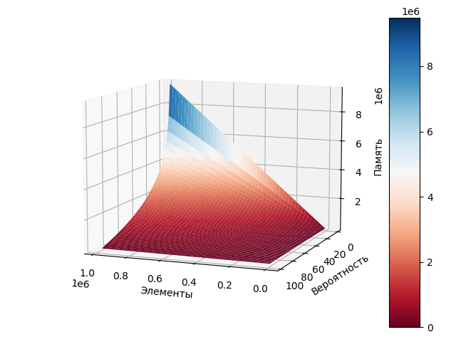

# Характеристики для фильтра Блума

Результаты

Зависимость расхода памяти в битах в зависимости от предполагаемого количества элементов и вероятности ложноположительного срабатываения.  
  

Зависимость количества хэш функций в зависимости от предполагаемого количества элементов и вероятности ложноположительного срабатываения.  
  