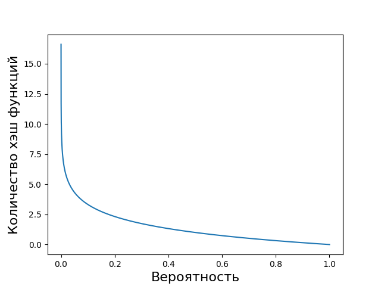

# Характеристики для фильтра Блума

Результаты

Зависимость расхода памяти в битах в зависимости от предполагаемого количества элементов и вероятности ложноположительного срабатываения.  

 где n - предполагаемое количество элементов хранящихся в фильтре Блума, p - вероятность ложноположительного срабатывания.  

  

Зависимость количества хэш функций в зависимости от предполагаемого количества элементов и вероятности ложноположительного срабатываения. 

где p - вероятность ложноположительного срабатывания.      
Следорвательно количество хэш-функций зависит только от выбранной вероятности.

Так как в данной работе используется 128 битная хэш функция, ее значения бьются на 4 части по 32 бита и каждый принимается как отдельный результат, то количество хэш функций делится на 4.

