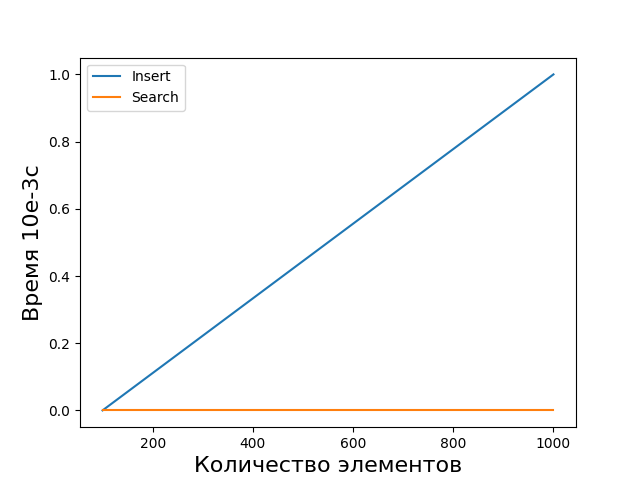
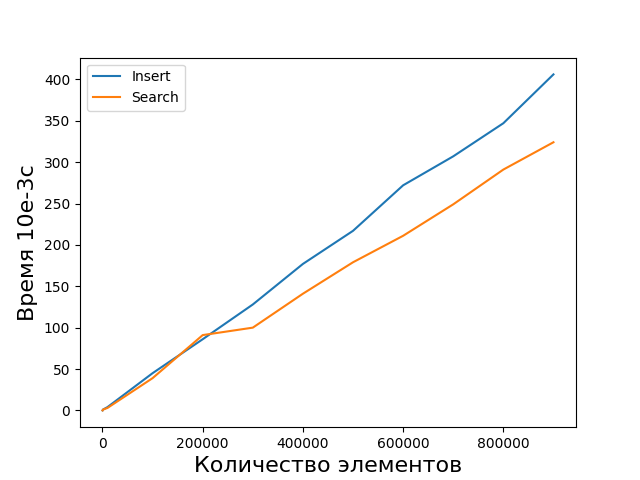
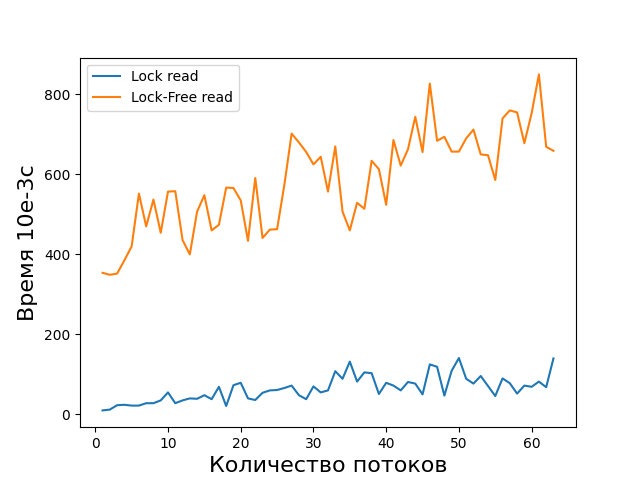
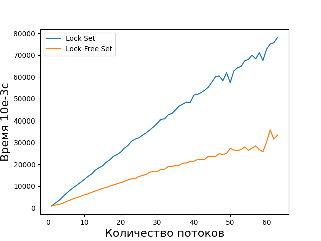

# Бенчмарк для списка с пропусками

Представлены две реализации:
1. Список с пропусками основанный на двусвязном интрузивном списке
2. Список с пропусками основанный на односвязном списке с Lock-Free чтением

Результаты
========================================
> Замеры произведены на процессоре Intel Core i5 3570

#### Сравнение операций для реализации №1
  
Операция поиска происходит быстрее вставки, что впринципе и логично, ведь поиск не производит аллокаций памяти.  

#### Сравнение операций для реализации №2
  
Операция поиска происходит быстрее вставки, что впринципе и логично, ведь поиск не производит аллокаций памяти.  

#### Многопоточное сравнение чтения для двух реализаций
Чтение производится для   записей. Каждый поток читает часть из этих данных, чтобы в сумме все потоки прочитали   записей.  
  
Чтение во второй реализации происходит намного быстрее из-за отсутствия критических секций.

#### Многопоточное сравнение записи для двух реализаций
Производится вставка для  записей. Каждый поток пишет часть из этих данных, чтобы в сумме все потоки вставили  записей.  
  
Запись происходит примерно одинаково.
