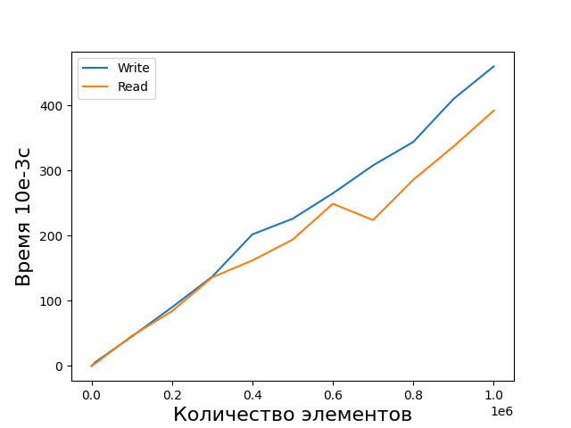
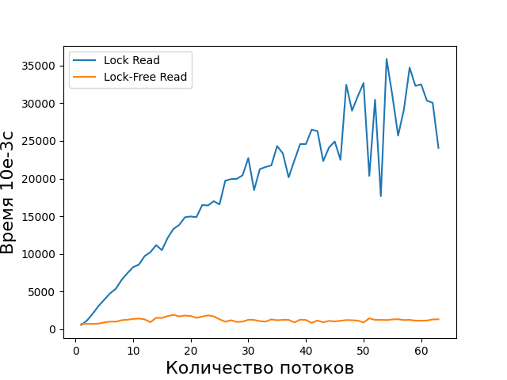

# Бенчмарк для списка с пропусками

Представлены две реализации:
1. Список с пропусками основанный на двусвязном списке
2. Lock-Free cписок с пропусками

Результаты
========================================
> Результаты получены:  
> Процессор Intel Core i5 3570  
> Оперативная память 16Гб  

#### Сравнение операций для реализации №1
  
Операция поиска происходит быстрее вставки, что впринципе и логично, ведь поиск не производит аллокаций памяти.  

#### Сравнение операций для реализации №2
  
Выполняется медленнее обычной реализации.

#### Многопоточное сравнение чтения для двух реализаций
Чтение производится для   записей. Каждый поток читает часть из этих данных, чтобы в сумме все потоки прочитали   записей.  
  
Чтение во второй реализации не изменяется при росте числа потоков, а первая реализации растет.

#### Многопоточное сравнение записи для двух реализаций
Производится вставка для  записей. Каждый поток пишет часть из этих данных, чтобы в сумме все потоки вставили  записей.  
  
Запись во второй реализации происходит быстрее, чем в первой.
